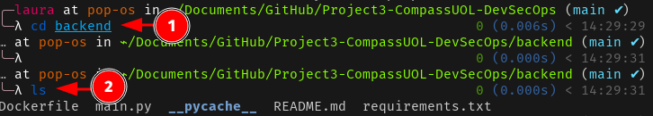
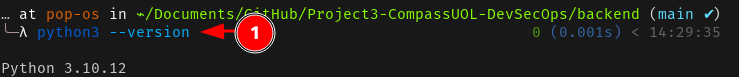
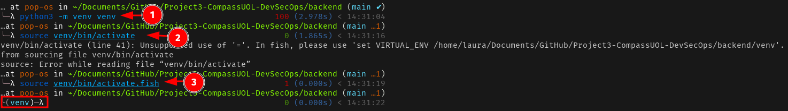
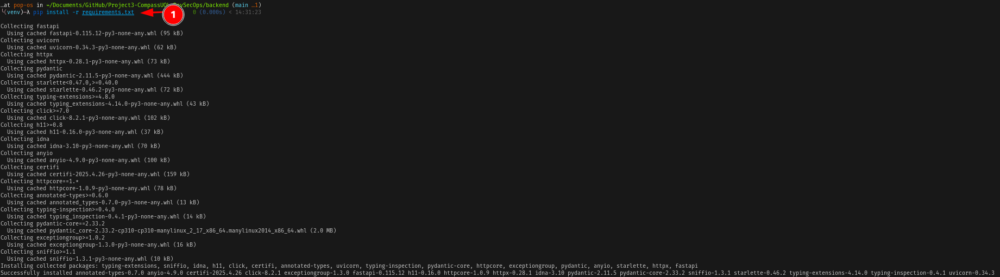
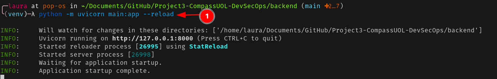
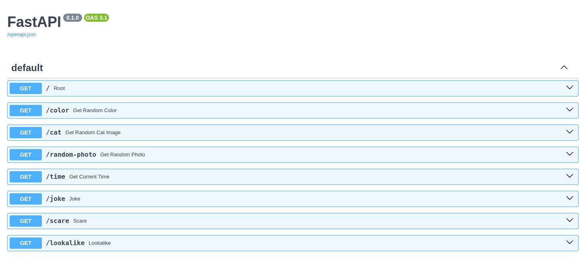
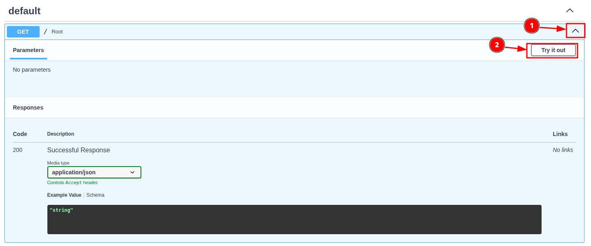
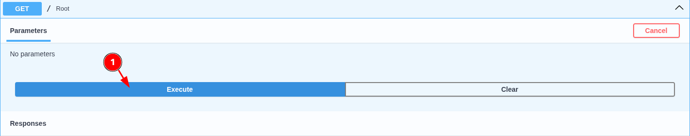
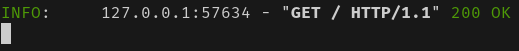

# Fase 1: Preparação do Projeto

Este documento descreve a configuração inicial do ambiente de desenvolvimento para a aplicação de exemplo com FastAPI, React e Kubernetes.

## 📋 Visão Geral

Esta fase estabelece a base para o desenvolvimento, incluindo:
- Configuração do repositório GitHub
- Preparação do ambiente Docker
- Configuração do cluster Kubernetes local
- Validação da aplicação rodando localmente

## 🎯 Objetivos

- [x] Criar repositório no GitHub
- [x] Configurar conta no Docker Hub
- [x] Verificar acesso ao cluster Kubernetes local
- [x] Validar execução local da aplicação

## 🛠️ Pré-requisitos

### Software Necessário
- **Python** 3.9+ 
- **Node.js** (versão LTS recomendada)
- **Git**
- **Rancher Desktop**

### Contas Necessárias
- Conta no [GitHub](https://github.com)
- Conta no [Docker Hub](https://hub.docker.com)

## 🚀 Configuração do Ambiente

### 1. Repositório GitHub

Crie um novo repositório seguindo a [documentação oficial](https://docs.github.com/pt/repositories/creating-and-managing-repositories/creating-a-new-repository).

**Repositório do projeto:** https://github.com/andrrade/Aplicacao-Exemplo-Project3

### 2. Docker Hub

Crie sua conta seguindo o [guia oficial](https://docs.docker.com/accounts/create-account/).

### 3. Kubernetes Local

Instale o [Rancher Desktop](https://docs.rancherdesktop.io/getting-started/installation/) para gerenciar o Kubernetes localmente.

**Validação da instalação:**
```bash
kubectl version --client
kubectl get pods
```


## 💻 Configuração da Aplicação

### Backend (FastAPI)

#### 1. Clone do Repositório
```bash
git clone https://github.com/andrrade/Aplicacao-Exemplo-Project3.git
cd Aplicacao-Exemplo-Project3/backend
```



#### 2. Verificação do Python
```bash
python3 --version
```

> **Versão utilizada:** Python 3.10.12



#### 3. Ambiente Virtual
```bash
# Criar ambiente virtual
python3 -m venv venv

# Ativar (Bash/Zsh)
source venv/bin/activate

# Ativar (Fish Shell)
source venv/bin/activate.fish
```



#### 4. Instalação de Dependências
```bash
pip install -r requirements.txt
```



#### 5. Execução da Aplicação
```bash
python -m uvicorn main:app --reload
```



#### 6. Teste da API
Acesse a documentação interativa em: http://localhost:8000/docs



#### 7. Validação das Rotas

Teste todas as rotas disponíveis através da interface Swagger:





✅ **Status esperado:** Todas as requisições devem retornar **200 OK**

### Frontend (React)

#### 1. Navegação para o diretório
```bash
cd ../frontend/src
```

#### 2. Instalação de dependências
```bash
npm install
```

#### 3. Execução da aplicação
```bash
npm start
```

#### 4. Acesso à aplicação
Abra o navegador em: http://localhost:3000

>[!WARNING]
> FALTA A IMAGEM

## ✅ Entregáveis Concluídos

| Item | Status | Evidência |
|------|--------|-----------|
| Ambiente preparado | ✅ | Configuração Kubernetes e ferramentas |
| Código rodando localmente | ✅ | Backend e Frontend funcionais |
| Repositório GitHub criado | ✅ | [Link do repositório](https://github.com/andrrade/Aplicacao-Exemplo-Project3) |

## 📌 Importante

Para dúvidas ou problemas:
1. Verifique se todos os pré-requisitos estão instalados
2. Confirme se as portas 8000 e 3000 estão disponíveis
3. Valide se o ambiente virtual está ativo antes de instalar dependências
4. Verifique se o rancher está funcionando corretamente
