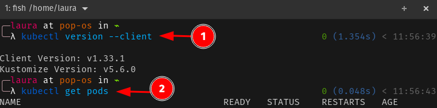

Fase 1: Preparação do projeto

Nesta fase será necessário crias as seguintes atividades:

- Criar um repositório de código no Github para inserir a aplicação de exemplo
- Criar conta no Docker Hub
- Verificar acesso ao cluster Kubernetes local
- Validar execução local com uvicorn

Entregáveis: Código rodando localmente, repositório do github criado e ambiente preparado

---

Para fazer o projeto, estou utilizando o Sistema Operacional [Pop!_OS](https://system76.com/pop/)
1. [Criar um repositório no GitHub](https://docs.github.com/pt/repositories/creating-and-managing-repositories/creating-a-new-repository)
2. [Criar conta no Docker Hub](https://docs.docker.com/accounts/create-account/)
3. Usei o [Rancher Desktop](https://docs.rancherdesktop.io/getting-started/installation/)
