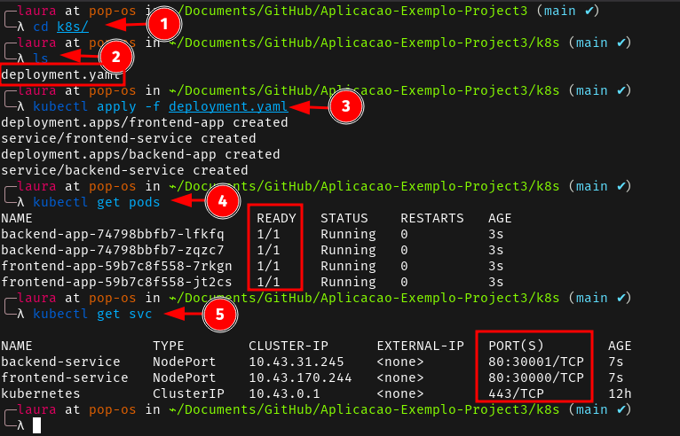
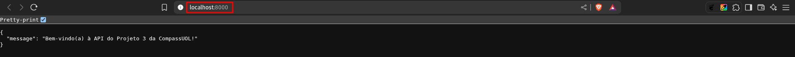
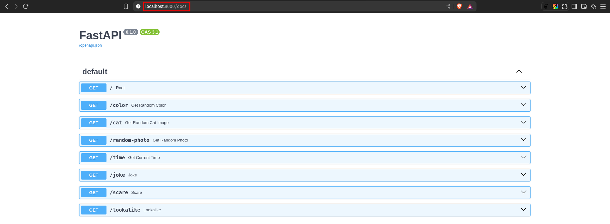
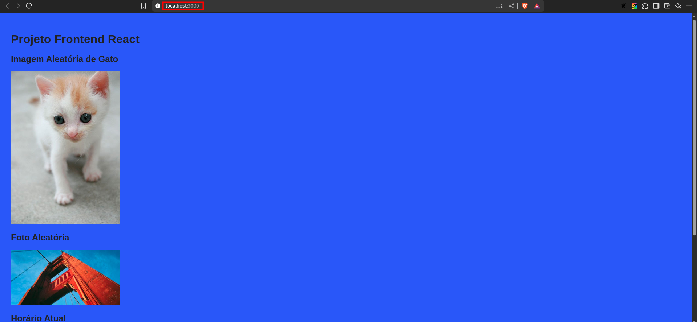
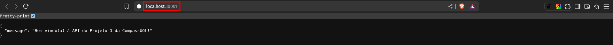
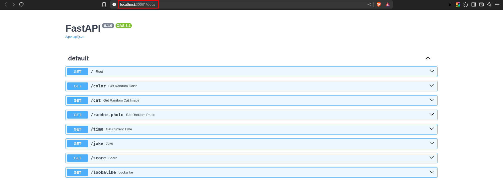

# Fase 3: Deploy no Kubernetes

Este documento detalha o processo de deployment da aplicação containerizada no cluster Kubernetes local.

## 📋 Visão Geral

Nesta fase, a imagem Docker criada na Fase 2 será deployada no Kubernetes, incluindo:
- Criação de manifests YAML para deployment e service
- Deploy no cluster Kubernetes local
- Exposição da aplicação via NodePort
- Validação do funcionamento da aplicação

## 🎯 Objetivos (Entregáveis)

- [X] Criar arquivo YAML de Deployment
- [X] Criar arquivo YAML de Service
- [X] Aplicar manifestos no cluster Kubernetes
- [X] Expor aplicação em localhost:30001
- [X] Validar funcionamento da aplicação via Kubernetes

## 🛠️ Pré-requisitos

### Software Necessário
- **Kubernetes local** (Rancher Desktop utilizado)

### Preparação das Imagens
```bash
docker-compose up -d

docker tag frontend-app:latest meu-frontend:v1.0.0
docker tag backend-app:latest meu-backend:v1.0.0

cd k8s/
```

## 📁 Estrutura de Arquivos

```
projeto/
├── k8s/
│   └── deployment.yaml       
└── ...
```

## ☸️ Configuração do Kubernetes

### 1. Deployment YAML

**Localização:** `k8s/deployment.yaml`

```yaml
# Frontend Deployment
apiVersion: apps/v1
kind: Deployment
metadata:
  name: frontend-app
  namespace: default
spec:
  replicas: 2
  selector:
    matchLabels:
      app: frontend-app
  template:
    metadata:
      labels:
        app: frontend-app
    spec:
      containers:
      - name: frontend-app
        image: meu-frontend:v1.0.0
        ports:
        - containerPort: 3000
        imagePullPolicy: IfNotPresent
---
# Frontend Service (exposto em localhost:30000)
apiVersion: v1
kind: Service
metadata:
  name: frontend-service
  namespace: default
spec:
  selector:
    app: frontend-app
  ports:
  - port: 80
    targetPort: 3000
    nodePort: 30000  
  type: NodePort
---
# Backend Deployment
apiVersion: apps/v1
kind: Deployment
metadata:
  name: backend-app
  namespace: default
spec:
  replicas: 2
  selector:
    matchLabels:
      app: backend-app
  template:
    metadata:
      labels:
        app: backend-app
    spec:
      containers:
      - name: backend-app
        image: meu-backend:v1.0.0
        ports:
        - containerPort: 8000
        imagePullPolicy: IfNotPresent
---
# Backend Service (exposto em localhost:30001)
apiVersion: v1
kind: Service
metadata:
  name: backend-service
  namespace: default
spec:
  selector:
    app: backend-app
  ports:
  - port: 80
    targetPort: 8000
    nodePort: 30001
  type: NodePort
```

### 2. Deploy no Kubernetes

```bash
kubectl apply -f deployment.yaml

kubectl get pods

kubectl get svc
```

**Evidência de Deploy:**



### 3. URLs de Acesso

**No Kubernetes (via NodePort):**
- **Backend API**: http://localhost:30001
- **Documentação API**: http://localhost:30001/docs
- **Frontend**: http://localhost:30000

**Originalmente no Docker Compose:**
- **Frontend**: http://localhost:3000
- **Backend**: http://localhost:8000
- **Documentação API**: http://localhost:8000/docs

## 📸 Evidências de Funcionamento

### Docker Compose (Referência)

**Backend**



**Documentação API**



**Frontend**



### Kubernetes (Deploy Final)

**Backend**



**Documentação API**



**Frontend**


## 🧪 Validação do Funcionamento

### Testes de Conectividade

```bash
# Testar backend API
curl http://localhost:30001

# Testar documentação Swagger
curl http://localhost:30001/docs

# Verificar se frontend carrega
curl http://localhost:30000
```

**Evidência dos Testes:**


### Checklist de Validação

- [X] Pods estão em status "Running"
- [X] Services estão criados e com NodePort configurado
- [X] Backend responde em http://localhost:30001 (mapeado do container :8000)
- [X] Documentação Swagger acessível em http://localhost:30001/docs
- [X] Frontend carrega em http://localhost:30000 (mapeado do container :3000)
- [X] Aplicação está funcionando corretamente via Kubernetes

## 🧹 Limpeza dos Recursos

### Kubernetes

```bash
# Deletar todos os recursos criados
kubectl delete -f deployment.yaml
```

### Docker

```bash
# Parar containers do Docker Compose
docker-compose down

# Remover imagens criadas
docker rmi -f aplicacao-exemplo-project3-backend:latest backend-app:latest meu-backend:v1.0.0 meu-frontend:v1.0.0 aplicacao-exemplo-project3-frontend:latest frontend-app:latest
```

## ✅ Entregáveis Concluídos

| Objetivo | Status | Evidência |
|----------|--------|-----------|
| Criar arquivo YAML de Deployment | ✅ | `k8s/deployment.yaml` criado |
| Criar arquivo YAML de Service | ✅ | Services incluídos no `deployment.yaml` |
| Aplicar manifestos no cluster Kubernetes | ✅ |  |
| Expor aplicação em localhost:30001 | ✅ |  |
| Validar funcionamento da aplicação via Kubernetes | ✅ |  |
