# Jenkins CI/CD com Kubernetes - Fases 4 e 5

Este guia documenta a implementação das fases 4 e 5 do projeto, onde configuramos uma pipeline completa de CI/CD usando Jenkins para build, push e deploy automatizado no Kubernetes.

## 📋 Pré-requisitos

- Rancher funcionando e configurado
- Conhecimento básico de Docker e Kubernetes
- Acesso ao DockerHub

## 🎯 Objetivos

### Fase 4: Jenkins - Build e Push
- Criar pipeline no Jenkins
- Realizar stage de build das imagens Docker
- Realizar stage de push para DockerHub

### Fase 5: Jenkins - Deploy no Kubernetes
- Configurar Jenkins para acessar kubectl
- Adicionar etapa de deploy no pipeline
- Testar pipeline completa

## 🛠️ Configuração do Ambiente

### 1. Criação da VM com Vagrant

Crie um arquivo `Vagrantfile` com a seguinte configuração:

```ruby
Vagrant.configure("2") do |config|
  config.vm.box = "generic/ubuntu2004"
  config.vm.provider "libvirt" do |libvirt|
    libvirt.memory = 2048
    libvirt.cpus = 2
  end
  config.vm.network "private_network", ip: "192.168.100.10"
  config.vm.hostname = "webserver"
end
```

Execute os comandos:
```bash
vagrant up
vagrant ssh
```

### 2. Instalação do Java (JDK 17)

```bash
sudo apt update && sudo apt install openjdk-17-jdk -y
```

### 3. Instalação do Jenkins

```bash
# Adicionar chave do Jenkins
sudo wget -O /usr/share/keyrings/jenkins-keyring.asc \
  https://pkg.jenkins.io/debian-stable/jenkins.io-2023.key

# Adicionar repositório
echo "deb [signed-by=/usr/share/keyrings/jenkins-keyring.asc] https://pkg.jenkins.io/debian-stable binary/" | sudo tee /etc/apt/sources.list.d/jenkins.list > /dev/null

# Instalar Jenkins
sudo apt-get update && sudo apt-get install -y jenkins
```

### 4. Obter Senha Inicial do Jenkins

```bash
sudo cat /var/lib/jenkins/secrets/initialAdminPassword
```

### 5. Instalação do Docker

```bash
# Adicionar chave GPG do Docker
sudo apt-get update
sudo apt-get install ca-certificates curl
sudo install -m 0755 -d /etc/apt/keyrings
sudo curl -fsSL https://download.docker.com/linux/ubuntu/gpg -o /etc/apt/keyrings/docker.asc
sudo chmod a+r /etc/apt/keyrings/docker.asc

# Adicionar repositório Docker
echo \
  "deb [arch=$(dpkg --print-architecture) signed-by=/etc/apt/keyrings/docker.asc] https://download.docker.com/linux/ubuntu \
  $(. /etc/os-release && echo "$VERSION_CODENAME") stable" | \
  sudo tee /etc/apt/sources.list.d/docker.list > /dev/null
sudo apt-get update

# Instalar Docker
sudo apt-get install docker-ce docker-ce-cli containerd.io docker-buildx-plugin docker-compose-plugin -y

# Adicionar usuários ao grupo docker
sudo usermod -aG docker $USER
sudo usermod -aG docker jenkins

# Reiniciar Jenkins
sudo systemctl restart jenkins
```

### 6. Instalação do Kubectl

```bash
# Adicionar chaves e repositórios
sudo apt-get update
sudo apt-get install -y apt-transport-https ca-certificates curl gnupg

curl -fsSL https://pkgs.k8s.io/core:/stable:/v1.30/deb/Release.key | sudo gpg --dearmor -o /etc/apt/keyrings/kubernetes-apt-keyring.gpg
sudo chmod 644 /etc/apt/keyrings/kubernetes-apt-keyring.gpg

# Adicionar repositório Kubernetes
echo 'deb [signed-by=/etc/apt/keyrings/kubernetes-apt-keyring.gpg] https://pkgs.k8s.io/core:/stable:/v1.30/deb/ /' | sudo tee /etc/apt/sources.list.d/kubernetes.list
sudo chmod 644 /etc/apt/sources.list.d/kubernetes.list

# Instalar kubectl
sudo apt-get update
sudo apt-get install -y kubectl
```

## ⚙️ Configuração do Jenkins

### 1. Acesso Inicial

Após a instalação, acesse Jenkins pelo IP da VM: `http://192.168.121.152:8080/`

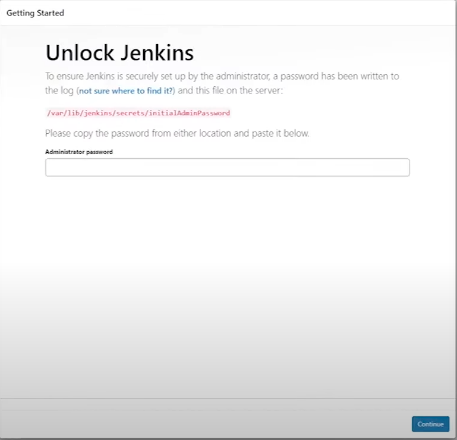

1. Insira a senha inicial obtida anteriormente
2. Clique em "Install suggested plugins"

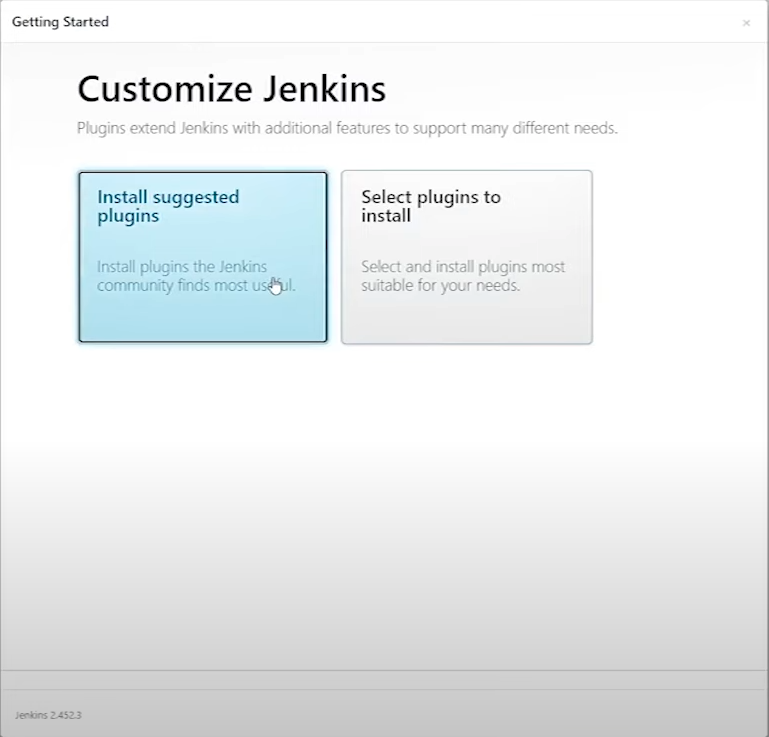

3. Aguarde a instalação completar

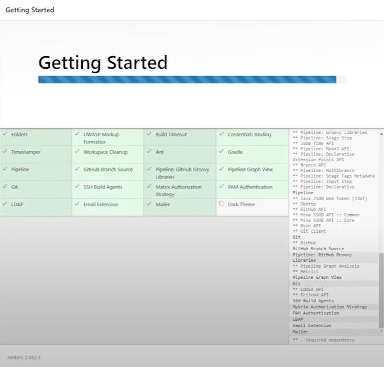

4. Crie conta de administrador

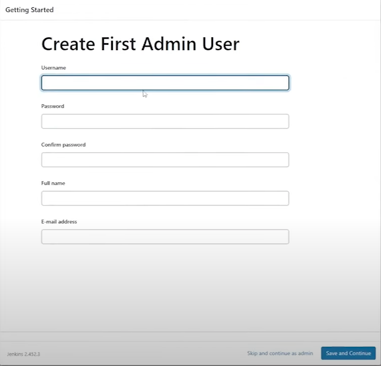

5. Mantenha URL padrão e continue

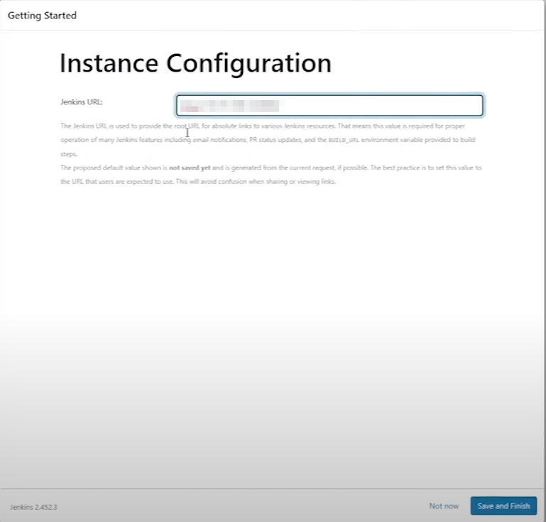

6. Clique em "Start using Jenkins"

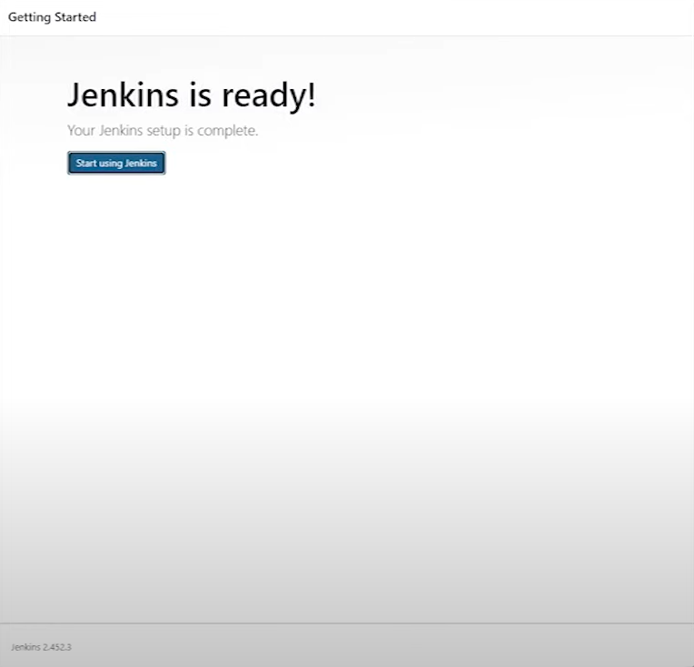

### 2. Instalação de Plugins

1. Vá em **Gerenciar Jenkins**

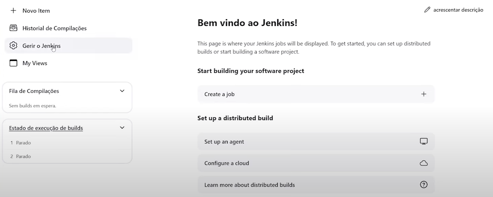

2. Clique em **Plugins**

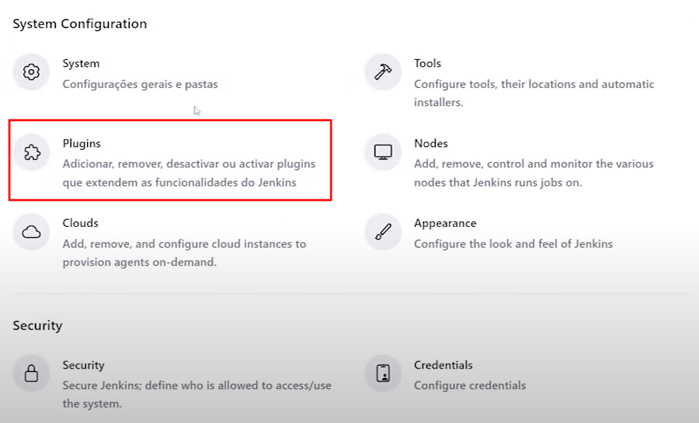

3. Vá em **Available Plugins**, pesquise por "docker" e instale **Docker** e **Docker Pipeline**

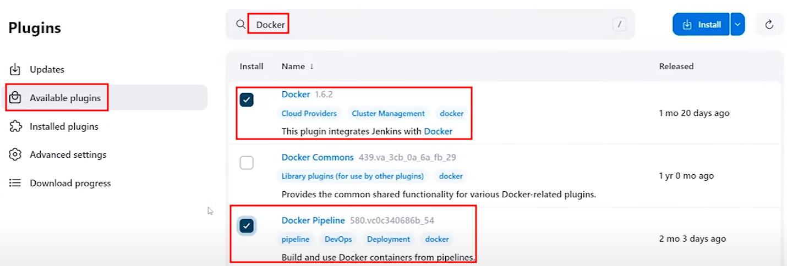

4. Pesquise por "kubernetes" e instale **Kubernetes CLI**

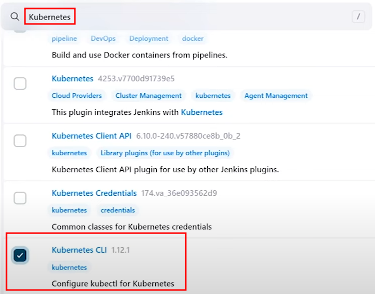

5. Também instale **Chuck Norris** (para diversão!)

6. Habilite a opção de reiniciar após instalação

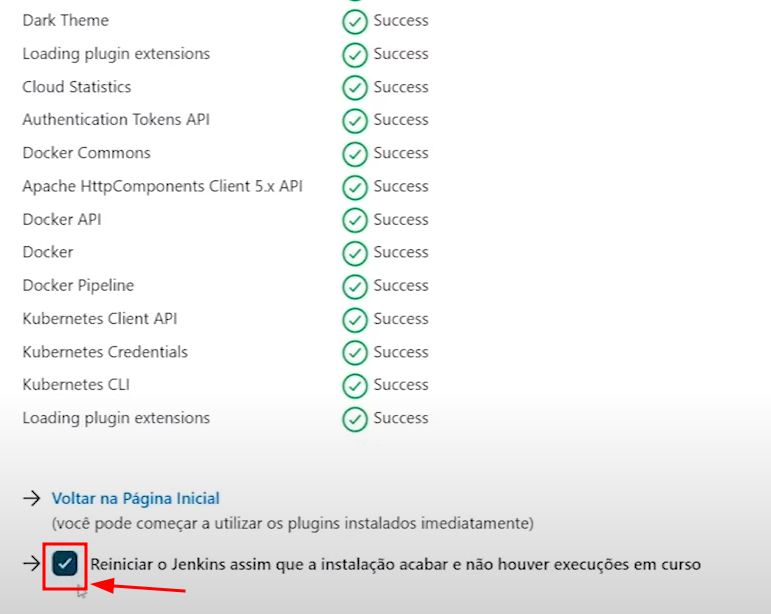

7. O Jenkins irá reiniciar automaticamente

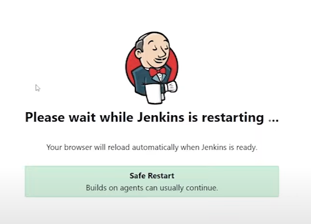

8. Faça login novamente com suas credenciais, e habilite a opção `keep me signed in`

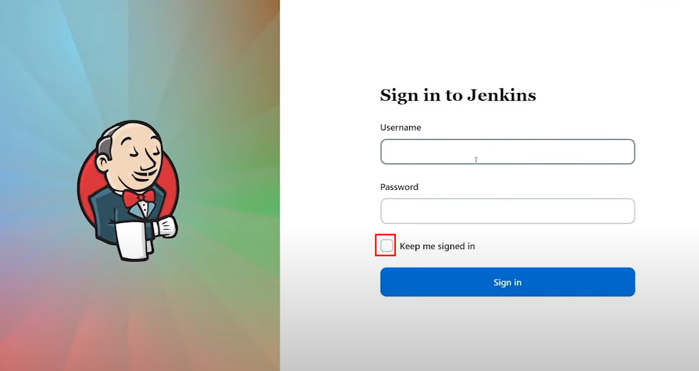

Verifique se os plugins foram instalados indo em **Installed Plugins** e procurando pelos nomes desejados.

### 3. Criação da Pipeline

1. Habilite **GitHub hook trigger** para depois fazer o webhook do GitHub funcionar

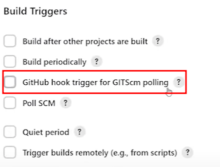

2. Clique em **Novo Item**

3. Selecione **Pipeline**, digite o nome do projeto (ex: "projeto3") e clique em OK

4. Em **Pipeline Definition**, selecione **"Pipeline script from SCM"**

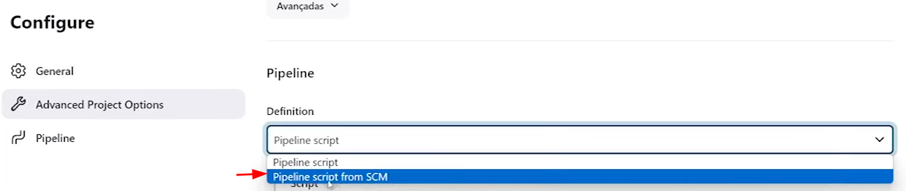

5. Selecione **Git** como SCM e cole a URL do seu repositório

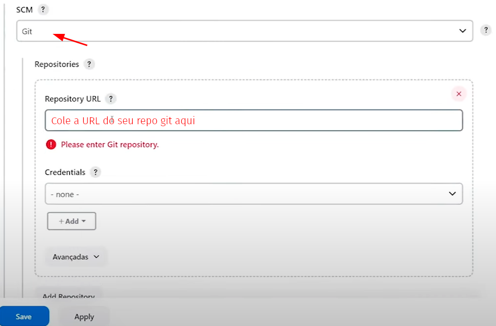

Para copiar a URL do repositório:

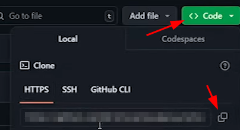

6. Altere a branch para **main**

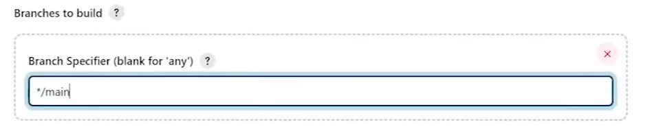

7. Salve a configuração da pipeline

## 📝 Jenkinsfile

Crie um arquivo `Jenkinsfile` na raiz do seu repositório:

```groovy
pipeline {
    agent any

    environment {
        DOCKERHUB_REPO = "andrrade"  // Substitua pelo seu usuário DockerHub
        BUILD_TAG = "${env.BUILD_ID}"
    }

    stages {
        stage('Build Frontend Docker Image') {
            steps {
                script {
                    frontendapp = docker.build("${DOCKERHUB_REPO}/meu-frontend:${BUILD_TAG}", '-f ./frontend/Dockerfile ./frontend')
                }
            }
        }
        stage('Build Backend Docker Image') {
            steps {
                script {
                    backendapp = docker.build("${DOCKERHUB_REPO}/meu-backend:${BUILD_TAG}", '-f ./backend/Dockerfile ./backend')
                }
            }
        }
        stage('Push Docker Images') {
            parallel {
                stage('Push Frontend') {
                    steps {
                        script {
                            docker.withRegistry('https://registry.hub.docker.com', 'dockerhub') {
                                frontendapp.push('latest')
                                frontendapp.push("${BUILD_TAG}")
                            }
                        }
                    }
                }
                stage('Push Backend') {
                    steps {
                        script {
                            docker.withRegistry('https://registry.hub.docker.com', 'dockerhub') {
                                backendapp.push('latest')
                                backendapp.push("${BUILD_TAG}")
                            }
                        }
                    }
                }
            }
        }
        stage('Deploy no Kubernetes') {
            steps {
                withKubeConfig([credentialsId: 'kubeconfig', serverUrl: 'https://192.168.1.81:6443']) {
                    script {
                        // Copia e substitui os placeholders pelas tags do build atual
                        sh """
                            cp ./k8s/deployment.yaml ./k8s/deployment.tmp.yaml
                            sed -i 's|{{FRONTEND_TAG}}|${BUILD_TAG}|g' ./k8s/deployment.tmp.yaml
                            sed -i 's|{{BACKEND_TAG}}|${BUILD_TAG}|g' ./k8s/deployment.tmp.yaml
                        """

                        sh 'kubectl apply -f ./k8s/deployment.tmp.yaml'

                        sh 'kubectl rollout status deployment/frontend-app'
                        sh 'kubectl rollout status deployment/backend-app'
                    }
                }
            }
        }
        stage('Verificar Deploy') {
            steps {
                withKubeConfig([credentialsId: 'kubeconfig', serverUrl: 'https://192.168.1.81:6443']) {
                    sh 'kubectl get pods -l app=frontend-app'
                    sh 'kubectl get pods -l app=backend-app'
                    sh 'kubectl get services'
                }
            }
        }
    }

    post {
        always {
            chuckNorris()
        }
        success {
            echo '🚀 Deploy realizado com sucesso!'
            echo '💪 Chuck Norris aprova seu pipeline DevSecOps!'
            echo "✅ Frontend: ${DOCKERHUB_REPO}/meu-frontend:${BUILD_TAG} deployado"
            echo "✅ Backend: ${DOCKERHUB_REPO}/meu-backend:${BUILD_TAG} deployado"
            echo '🌐 Frontend disponível em: http://localhost:30000'
            echo '🔧 Backend disponível em: http://localhost:30001'
        }
        failure {
            echo '❌ Build falhou, mas Chuck Norris nunca desiste!'
            echo '🔍 Chuck Norris está investigando o problema...'
            echo '💡 Verifique: Docker build, DockerHub push ou Kubernetes deploy'
        }
        unstable {
            echo '⚠️ Build instável - Chuck Norris está monitorando'
        }
    }
}
```

## 🔐 Configuração de Credenciais

### Credenciais DockerHub
1. Vá em **Gerenciar Jenkins > Credenciais**
2. Clique em **Sistema > Global credentials**
3. Adicione credencial do tipo **Username with password**
4. ID: `dockerhub`
5. Username: Seu usuário DockerHub
6. Password: Sua senha DockerHub

### Credenciais Kubernetes
1. Copie o arquivo kubeconfig do seu cluster
2. Adicione credencial do tipo **Secret file**
3. ID: `kubeconfig`
4. Faça upload do arquivo kubeconfig

## Credenciais do GitHub
1. Acesse: Gerenciar Jenkins > Credenciais.
2. Clique em: Sistema > Global credentials (global).
3. Adicione uma credencial do tipo Username with password:
4. ID: github-creds
5. Username: seu_usarname
6. Password: Sua senha do GitHub

## 🚀 Executando a Pipeline

1. Acesse sua pipeline no Jenkins
2. Clique em **Build Now** para execução manual

## 📊 Entregáveis

### Fase 4
- ✅ Pipeline funcional no Jenkins
- ✅ Build automatizado das imagens Docker
- ✅ Push das imagens para DockerHub

### Fase 5
- ✅ Jenkins configurado com kubectl
- ✅ Deploy automatizado no Kubernetes
- ✅ Pipeline completa funcionando

## 🔗 Referências

- [Vídeo Tutorial - Veronez](https://www.youtube.com/watch?v=mvtVL5eivzo&t=4683s)
- [Documentação oficial do Jenkins](https://www.jenkins.io/doc/)
- [Documentação oficial do Kubernetes](https://kubernetes.io/docs/home/)

## 📝 Observações

- Certifique-se de que o Rancher esteja funcionando antes de executar a pipeline
- Substitua `DOCKERHUB_REPO` pelo seu usuário do DockerHub
- Ajuste o `serverUrl` do Kubernetes conforme seu ambiente
- Os serviços ficam disponíveis nas portas 30000 (frontend) e 30001 (backend)

---

## Demonstração:

[video-demonstracao](../../assets/fase04-05/video-demonstracao01.mp4)

https://github.com/user-attachments/assets/05662693-d16e-4715-9c78-9645747b4e46
