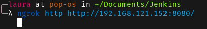
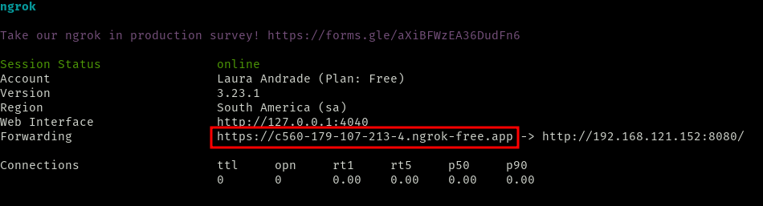
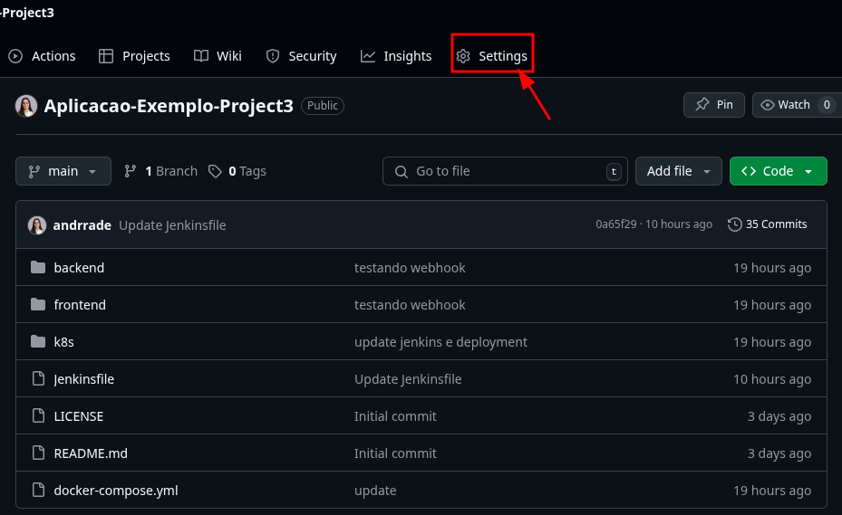
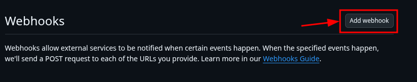
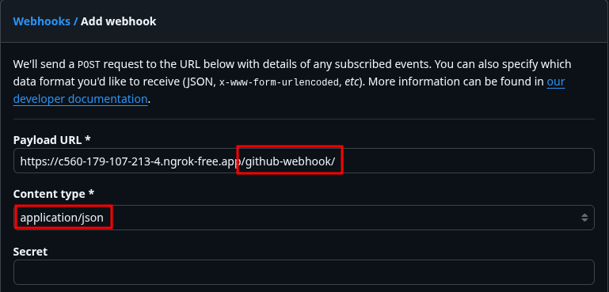
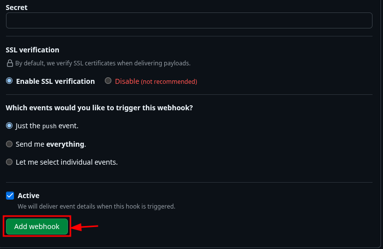
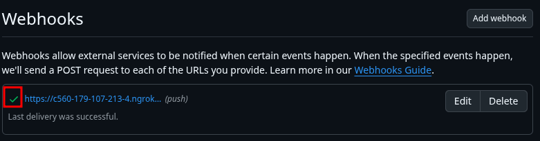
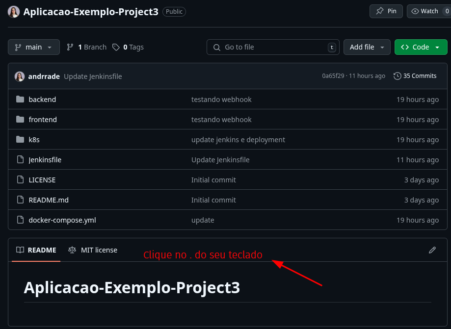
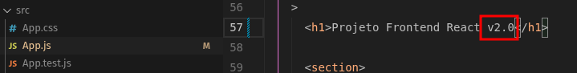
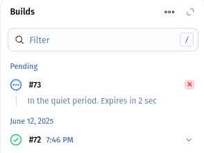

Tenha o ngrok instalado e faça ele direcionar para a porta onde está o jenkins (no meu caso, ele estava dentro da VM):

```sh
ngrok http http://192.168.121.152:8080/
```



Copie o link que foi gerado:



No github, vá em settings



Clique em webhooks e Add webhook


Cole o link gerado pelo ngrok e adicione /github-webhook/ no final



Selecione application/json e depois clique em Add webhook



Confira se está com um certinho, de que está funcionando corretamente



Clique no `.` do seu teclado para abrir o vscode no navegador



Altere uma parte do seu código



Commite a alteração



O jenkins irá buildar automaticamente



