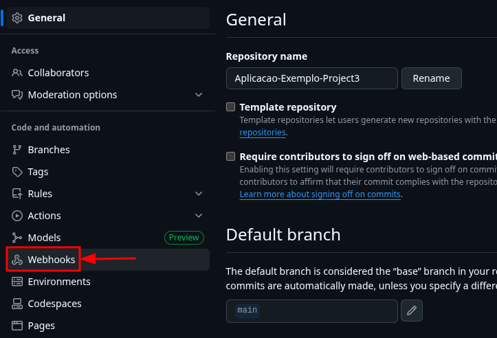
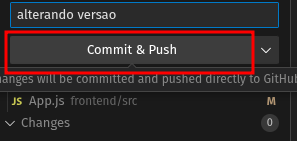

Tenha o ngrok instalado e faça ele direcionar para a porta onde está o jenkins (no meu caso, ele estava dentro da VM):

```sh
ngrok http http://192.168.121.152:8080/
```


Copie o link que foi gerado:


No github, vá em settings


Clique em webhooks e Add webhook



Cole o link gerado pelo ngrok e adicione /github-webhook/ no final


Selecione application/json e depois clique em Add webhook


Confira se está com um certinho, de que está funcionando corretamente


Clique no `.` do seu teclado para abrir o vscode no navegador


Altere uma parte do seu código


Commite a alteração


O jenkins irá buildar automaticamente




