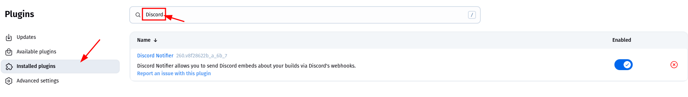
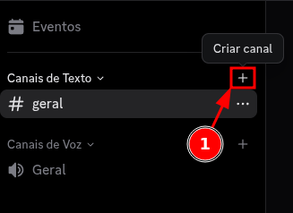
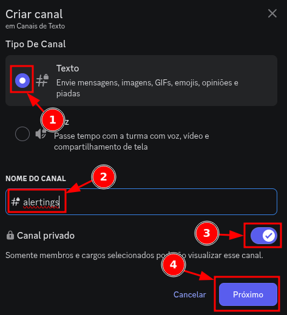
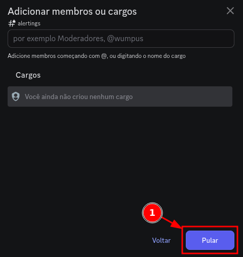
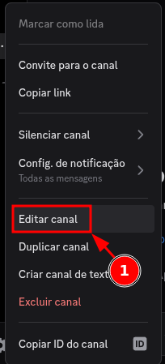
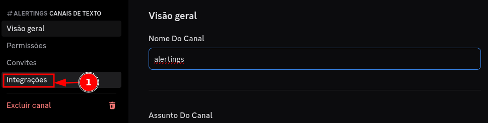

Para colocar o webhook no discord, instale no jenkins o plugin Discord Notifier

## Criar o Webhook no Discord

➡️ Abra o seu discord:

### `(parte 1):` Webhook no Discord 

1. No canto inferior esquerdo, clique no `+` para Adicionar um servidor

### `(parte 2):` Webhook no Discord 

1. Clique em `Criar o meu`

### `(parte 3):` Webhook no Discord 

1. Clique em `Para meus amigos e eu`

### `(parte 4):` Webhook no Discord 

1. Dê um nome ao servidor
2. Clique em `Criar`

### `(parte 5):` Webhook no Discord 

1. Em canais de texto, clique no `+` para criar canal

### `(parte 6):` Webhook no Discord 

1. Selecione o tipo como `Texto`
2. Dê um nome para o canal

> [!NOTE]
> 3. Optei em deixar o canal como privado, mas vai da sua preferência

4. Clique em `Próximo`

### `(parte 7):` Webhook no Discord 

1. Clique em `Pular`

### `(parte 8):` Webhook no Discord 

1. No canal criado, clique em `...` para abrir as opções de canal

### `(parte 9):` Webhook no Discord 

1. Clique em `Editar canal`

### `(parte 10):` Webhook no Discord 

1. Clique em `Integrações`

### `(parte 11):` Webhook no Discord 

1. Clique em `Criar webhook`

### `(parte 12):` Webhook no Discord 

> [!NOTE]
> Você provavelmente já terá um webhook criado, vai da sua preferência usá-lo ou criar outro.
> Eu usei o padrão mesmo.

1. Clique no `Webhook`

### `(parte 13):` Webhook no Discord 

1. Dê o nome de sua preferência
2. Copie a `URL`

> [!IMPORTANT]
> Essa é a URL que você irá colocar no seu jenkinsfile

3. Clique em `Salvar alterações`

---
