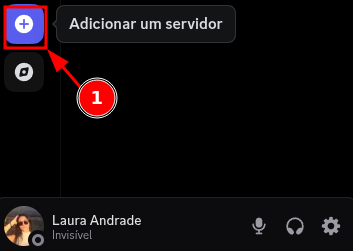
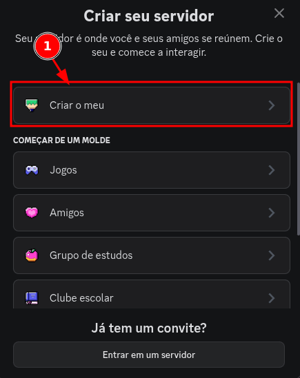
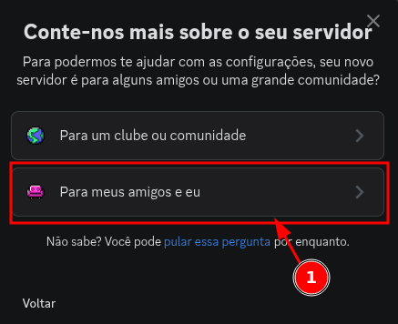
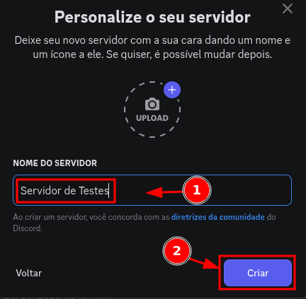
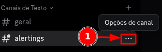
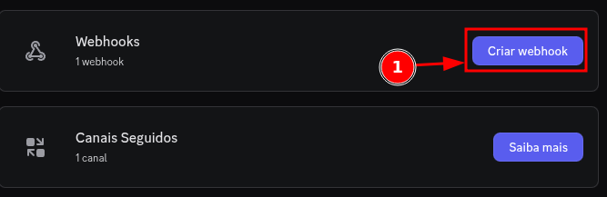
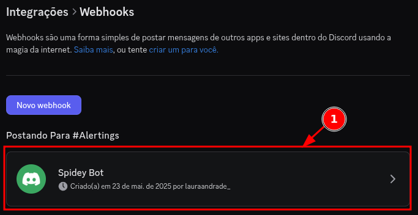
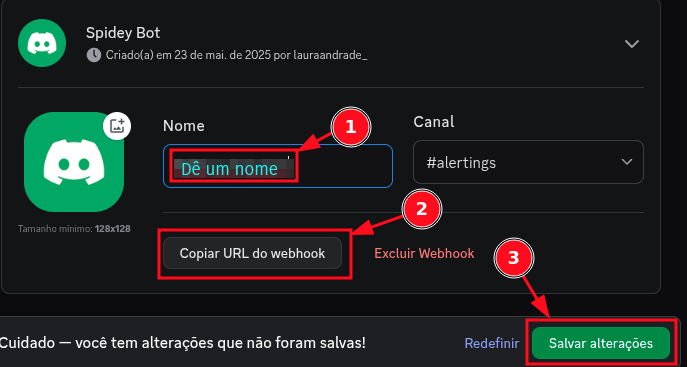
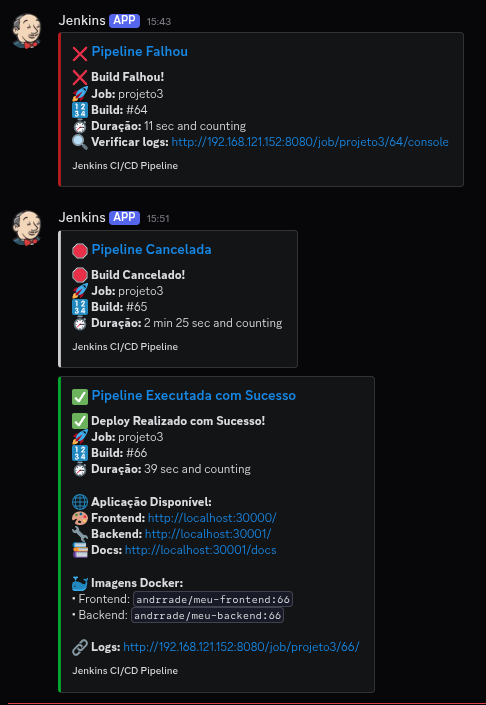

Para colocar o webhook no discord, instale no jenkins o plugin Discord Notifier


Instale também o plugin `HTTP Request` no Jenkins

## Criar o Webhook no Discord

➡️ Abra o seu discord:

### `(parte 1):` Webhook no Discord 

1. No canto inferior esquerdo, clique no `+` para Adicionar um servidor



### `(parte 2):` Webhook no Discord 

1. Clique em `Criar o meu`



### `(parte 3):` Webhook no Discord 

1. Clique em `Para meus amigos e eu`



### `(parte 4):` Webhook no Discord 

1. Dê um nome ao servidor
2. Clique em `Criar`



### `(parte 5):` Webhook no Discord 

1. Em canais de texto, clique no `+` para criar canal


### `(parte 6):` Webhook no Discord 

1. Selecione o tipo como `Texto`
2. Dê um nome para o canal

> [!NOTE]
> 3. Optei em deixar o canal como privado, mas vai da sua preferência

4. Clique em `Próximo`


### `(parte 7):` Webhook no Discord 

1. Clique em `Pular`


### `(parte 8):` Webhook no Discord 

1. No canal criado, clique em `...` para abrir as opções de canal



### `(parte 9):` Webhook no Discord 

1. Clique em `Editar canal`


### `(parte 10):` Webhook no Discord 

1. Clique em `Integrações`


### `(parte 11):` Webhook no Discord 

1. Clique em `Criar webhook`



### `(parte 12):` Webhook no Discord 

> [!NOTE]
> Você provavelmente já terá um webhook criado, vai da sua preferência usá-lo ou criar outro.
> Eu usei o padrão mesmo.

1. Clique no `Webhook`



### `(parte 13):` Webhook no Discord 

1. Dê o nome de sua preferência
2. Copie a `URL`

> [!IMPORTANT]
> Essa é a URL que você irá colocar no seu jenkinsfile

3. Clique em `Salvar alterações`



---

Altere o final do seu jenkinsfile:

```jenkinsfile
    post {
        always {
            chuckNorris()
            sh 'rm -f ./trivy ./k8s/deployment.tmp.yaml frontend-scan.json backend-scan.json'
        }
        success {
            echo '🚀 Deploy realizado com sucesso!'
            echo "✅ Frontend: ${DOCKERHUB_REPO}/meu-frontend:${BUILD_TAG}"
            echo "✅ Backend: ${DOCKERHUB_REPO}/meu-backend:${BUILD_TAG}"
            
            // Notificação Discord para sucesso
            discordSend(
                description: """
**✅ Deploy Realizado com Sucesso!**
🚀 **Job:** ${JOB_NAME}
🔢 **Build:** #${BUILD_NUMBER}
⏱️ **Duração:** ${currentBuild.durationString}

**🌐 Aplicação Disponível:**
🎨 **Frontend:** http://localhost:30000
🔧 **Backend:** http://localhost:30001
📚 **Docs:** http://localhost:30001/docs

**🐳 Imagens Docker:**
• Frontend: `${DOCKERHUB_REPO}/meu-frontend:${BUILD_TAG}`
• Backend: `${DOCKERHUB_REPO}/meu-backend:${BUILD_TAG}`

🔗 **Logs:** ${BUILD_URL}
""",
                footer: "Jenkins CI/CD Pipeline",
                link: env.BUILD_URL,
                result: "SUCCESS",
                title: "✅ Pipeline Executada com Sucesso",
                webhookURL: env.DISCORD_WEBHOOK
            )
        }
        failure {
            echo '❌ Build falhou!'
            
            // Notificação Discord para falha
            discordSend(
                description: """
**❌ Build Falhou!**
🚀 **Job:** ${JOB_NAME}
🔢 **Build:** #${BUILD_NUMBER}
⏱️ **Duração:** ${currentBuild.durationString}
🔍 **Verificar logs:** ${BUILD_URL}console
""",
                footer: "Jenkins CI/CD Pipeline",
                link: env.BUILD_URL,
                result: "FAILURE",
                title: "❌ Pipeline Falhou",
                webhookURL: env.DISCORD_WEBHOOK
            )
        }
        unstable {
            echo '⚠️ Build instável!'
            
            // Notificação Discord para build instável
            discordSend(
                description: """
**⚠️ Build Instável!**
🚀 **Job:** ${JOB_NAME}
🔢 **Build:** #${BUILD_NUMBER}
⏱️ **Duração:** ${currentBuild.durationString}
🔍 **Verificar logs:** ${BUILD_URL}console
""",
                footer: "Jenkins CI/CD Pipeline",
                link: env.BUILD_URL,
                result: "UNSTABLE",
                title: "⚠️ Pipeline Instável",
                webhookURL: env.DISCORD_WEBHOOK
            )
        }
        aborted {
            echo '🛑 Build cancelado!'
            
            // Notificação Discord para build cancelado
            discordSend(
                description: """
**🛑 Build Cancelado!**
🚀 **Job:** ${JOB_NAME}
🔢 **Build:** #${BUILD_NUMBER}
⏱️ **Duração:** ${currentBuild.durationString}
""",
                footer: "Jenkins CI/CD Pipeline",
                link: env.BUILD_URL,
                result: "ABORTED",
                title: "🛑 Pipeline Cancelada",
                webhookURL: env.DISCORD_WEBHOOK
            )
        }
    }
}
```

Jenkinsfile completo:

```jenkinsfile
pipeline {
    agent any

    environment {
        DOCKERHUB_REPO = "andrrade"
        BUILD_TAG = "${env.BUILD_ID}"
        DISCORD_WEBHOOK = "https://discordapp.com/api/webhooks/1382761573411721216/7M3tXv4XD7_H3xEjYUJndbOm9sGWkPABuLSvXssREJmWckZ6tYSqn9LYrUN0eFjKEgDX"
    }

    stages {
        stage('Build Images') {
            parallel {
                stage('Frontend') {
                    steps {
                        script {
                            frontendapp = docker.build("${DOCKERHUB_REPO}/meu-frontend:${BUILD_TAG}", '-f ./frontend/Dockerfile ./frontend')
                        }
                    }
                }
                stage('Backend') {
                    steps {
                        script {
                            backendapp = docker.build("${DOCKERHUB_REPO}/meu-backend:${BUILD_TAG}", '-f ./backend/Dockerfile ./backend')
                        }
                    }
                }
            }
        }
        
        stage('Push Images') {
            parallel {
                stage('Push Frontend') {
                    steps {
                        script {
                            docker.withRegistry('https://registry.hub.docker.com', 'dockerhub') {
                                frontendapp.push('latest')
                                frontendapp.push("${BUILD_TAG}")
                            }
                        }
                    }
                }
                stage('Push Backend') {
                    steps {
                        script {
                            docker.withRegistry('https://registry.hub.docker.com', 'dockerhub') {
                                backendapp.push('latest')
                                backendapp.push("${BUILD_TAG}")
                            }
                        }
                    }
                }
            }
        }
        
        stage('Security Scan') {
            parallel {
                stage('Scan Frontend') {
                    steps {
                        script {
                            sh '''
                                if ! command -v trivy &> /dev/null; then
                                    curl -sfL https://raw.githubusercontent.com/aquasecurity/trivy/main/contrib/install.sh | sh -s -- -b .
                                fi
                            '''
                            
                            def trivyCmd = sh(script: 'command -v trivy', returnStatus: true) == 0 ? 'trivy' : './trivy'
                            
                            sh """
                                ${trivyCmd} image --format table --exit-code 0 ${DOCKERHUB_REPO}/meu-frontend:${BUILD_TAG}
                            """
                            
                            sh """
                                ${trivyCmd} image --format json --quiet ${DOCKERHUB_REPO}/meu-frontend:${BUILD_TAG} > frontend-scan.json
                                
                                python3 << 'EOF'
import json
try:
    with open('frontend-scan.json', 'r') as f:
        data = json.load(f)
    
    critical = high = medium = low = unknown = 0
    for result in data.get('Results', []):
        for vuln in result.get('Vulnerabilities', []):
            severity = vuln.get('Severity', 'UNKNOWN').upper()
            if severity == 'CRITICAL': 
                critical += 1
            elif severity == 'HIGH': 
                high += 1
            elif severity == 'MEDIUM': 
                medium += 1
            elif severity == 'LOW': 
                low += 1
            else: 
                unknown += 1
    
    total = critical + high + medium + low + unknown
    print(f"Frontend - Total: {total} (UNKNOWN: {unknown}, LOW: {low}, MEDIUM: {medium}, HIGH: {high}, CRITICAL: {critical})")
except:
    print("Frontend - Scan error")
EOF
                            """
                        }
                    }
                }
                
                stage('Scan Backend') {
                    steps {
                        script {
                            sh '''
                                if ! command -v trivy &> /dev/null; then
                                    curl -sfL https://raw.githubusercontent.com/aquasecurity/trivy/main/contrib/install.sh | sh -s -- -b .
                                fi
                            '''
                            
                            def trivyCmd = sh(script: 'command -v trivy', returnStatus: true) == 0 ? 'trivy' : './trivy'
                            
                            sh """
                                ${trivyCmd} image --format table --exit-code 0 ${DOCKERHUB_REPO}/meu-backend:${BUILD_TAG}
                            """
                            
                            sh """
                                ${trivyCmd} image --format json --quiet ${DOCKERHUB_REPO}/meu-backend:${BUILD_TAG} > backend-scan.json
                                
                                python3 << 'EOF'
import json
try:
    with open('backend-scan.json', 'r') as f:
        data = json.load(f)
    
    critical = high = medium = low = unknown = 0
    for result in data.get('Results', []):
        for vuln in result.get('Vulnerabilities', []):
            severity = vuln.get('Severity', 'UNKNOWN').upper()
            if severity == 'CRITICAL': 
                critical += 1
            elif severity == 'HIGH': 
                high += 1
            elif severity == 'MEDIUM': 
                medium += 1
            elif severity == 'LOW': 
                low += 1
            else: 
                unknown += 1
    
    total = critical + high + medium + low + unknown
    print(f"Backend - Total: {total} (UNKNOWN: {unknown}, LOW: {low}, MEDIUM: {medium}, HIGH: {high}, CRITICAL: {critical})")
except:
    print("Backend - Scan error")
EOF
                            """
                        }
                    }
                }
            }
        }
        
        stage('Deploy') {
            when {
                not { 
                    anyOf {
                        equals expected: 'FAILURE', actual: currentBuild.result
                        equals expected: 'ABORTED', actual: currentBuild.result
                    }
                }
            }
            steps {
                withKubeConfig([credentialsId: 'kubeconfig', serverUrl: 'https://192.168.1.81:6443']) {
                    sh """
                        cp ./k8s/deployment.yaml ./k8s/deployment.tmp.yaml
                        sed -i 's|{{FRONTEND_TAG}}|${BUILD_TAG}|g' ./k8s/deployment.tmp.yaml
                        sed -i 's|{{BACKEND_TAG}}|${BUILD_TAG}|g' ./k8s/deployment.tmp.yaml
                        kubectl apply -f ./k8s/deployment.tmp.yaml
                        kubectl rollout status deployment/frontend-app
                        kubectl rollout status deployment/backend-app
                    """
                }
            }
        }
        
        stage('Verify') {
            when {
                not { 
                    anyOf {
                        equals expected: 'FAILURE', actual: currentBuild.result
                        equals expected: 'ABORTED', actual: currentBuild.result
                    }
                }
            }
            steps {
                withKubeConfig([credentialsId: 'kubeconfig', serverUrl: 'https://192.168.1.81:6443']) {
                    sh '''
                        kubectl get pods -l app=frontend-app
                        kubectl get pods -l app=backend-app
                        kubectl get services
                    '''
                }
            }
        }
    }

    post {
        always {
            chuckNorris()
            sh 'rm -f ./trivy ./k8s/deployment.tmp.yaml frontend-scan.json backend-scan.json'
        }
        success {
            echo '🚀 Deploy realizado com sucesso!'
            echo "✅ Frontend: ${DOCKERHUB_REPO}/meu-frontend:${BUILD_TAG}"
            echo "✅ Backend: ${DOCKERHUB_REPO}/meu-backend:${BUILD_TAG}"
            
            // Notificação Discord para sucesso
            discordSend(
                description: """
**✅ Deploy Realizado com Sucesso!**
🚀 **Job:** ${JOB_NAME}
🔢 **Build:** #${BUILD_NUMBER}
⏱️ **Duração:** ${currentBuild.durationString}

**🌐 Aplicação Disponível:**
🎨 **Frontend:** http://localhost:30000
🔧 **Backend:** http://localhost:30001
📚 **Docs:** http://localhost:30001/docs

**🐳 Imagens Docker:**
• Frontend: `${DOCKERHUB_REPO}/meu-frontend:${BUILD_TAG}`
• Backend: `${DOCKERHUB_REPO}/meu-backend:${BUILD_TAG}`

🔗 **Logs:** ${BUILD_URL}
""",
                footer: "Jenkins CI/CD Pipeline",
                link: env.BUILD_URL,
                result: "SUCCESS",
                title: "✅ Pipeline Executada com Sucesso",
                webhookURL: env.DISCORD_WEBHOOK
            )
        }
        failure {
            echo '❌ Build falhou!'
            
            // Notificação Discord para falha
            discordSend(
                description: """
**❌ Build Falhou!**
🚀 **Job:** ${JOB_NAME}
🔢 **Build:** #${BUILD_NUMBER}
⏱️ **Duração:** ${currentBuild.durationString}
🔍 **Verificar logs:** ${BUILD_URL}console
""",
                footer: "Jenkins CI/CD Pipeline",
                link: env.BUILD_URL,
                result: "FAILURE",
                title: "❌ Pipeline Falhou",
                webhookURL: env.DISCORD_WEBHOOK
            )
        }
        unstable {
            echo '⚠️ Build instável!'
            
            // Notificação Discord para build instável
            discordSend(
                description: """
**⚠️ Build Instável!**
🚀 **Job:** ${JOB_NAME}
🔢 **Build:** #${BUILD_NUMBER}
⏱️ **Duração:** ${currentBuild.durationString}
🔍 **Verificar logs:** ${BUILD_URL}console
""",
                footer: "Jenkins CI/CD Pipeline",
                link: env.BUILD_URL,
                result: "UNSTABLE",
                title: "⚠️ Pipeline Instável",
                webhookURL: env.DISCORD_WEBHOOK
            )
        }
        aborted {
            echo '🛑 Build cancelado!'
            
            // Notificação Discord para build cancelado
            discordSend(
                description: """
**🛑 Build Cancelado!**
🚀 **Job:** ${JOB_NAME}
🔢 **Build:** #${BUILD_NUMBER}
⏱️ **Duração:** ${currentBuild.durationString}
""",
                footer: "Jenkins CI/CD Pipeline",
                link: env.BUILD_URL,
                result: "ABORTED",
                title: "🛑 Pipeline Cancelada",
                webhookURL: env.DISCORD_WEBHOOK
            )
        }
    }
}
```

Webhook funcionando:


