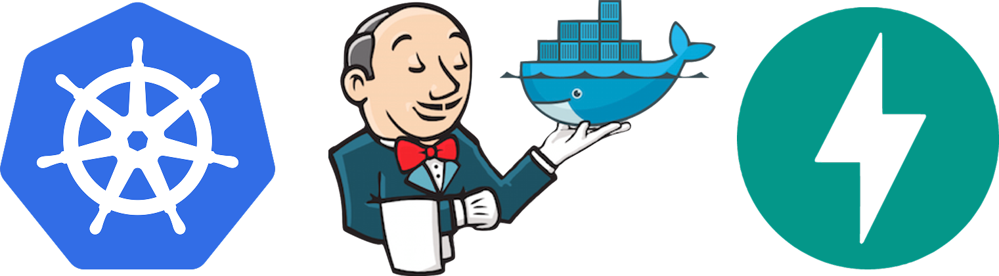

  

 

# Deploy automatizado de API com FastAPI, Jenkins e Kubernetes

  
  
  
  
  
  
  

---

[Repo Aplicacao](https://github.com/andrrade/Aplicacao-Exemplo-Project3)

## 💻 Tecnologias Utilizadas

* **FastAPI**: Framework web em Python.
* **Docker**: Para conteinerização da aplicação.
* **Docker Hub**: Registro público de imagens.
* **Jenkins**: Ferramenta de CI/CD.
* **Kubernetes (Rancher Desktop)**: Orquestrador de contêineres utilizado localmente.
* **Node.js**: Runtime JavaScript usado no backend.
* **React**: Biblioteca JavaScript para criação do frontend.

Para este projeto, utilizei o sistema operacional [Pop!\_OS](https://system76.com/pop/).

## Sumário 📝

- [Enunciado](https://github.com/andrrade/Project3-CompassUOL-DevSecOps/blob/main/PB-Projeto-DevOps.pdf)

- [Fase 1](https://github.com/andrrade/Project3-CompassUOL-DevSecOps/blob/main/Fases/01-Preparacao-do-Projeto/README.md)  
  - [X] Criar um repositório de código no Github para inserir a aplicação de exemplo  
  - [X] Criar conta no Docker Hub  
  - [X] Verificar acesso ao cluster Kubernetes local  
  - [X] Validar execução local com uvicorn  

- [Fase 2](https://github.com/andrrade/Project3-CompassUOL-DevSecOps/blob/main/Fases/02-Conteinerizacao-com-Docker/README.md)  
  - [X] Criar o Dockerfile  
  - [X] Fazer build
  - [X] Fazer push
  - [X] Versionar o Dockerfile junto com o código da aplicação no GitHub  

- [Fase 3](https://github.com/andrrade/Project3-CompassUOL-DevSecOps/blob/main/Fases/03-Arquivos-de-Deploy-no-Kubernetes/README.md)  
  - [X] Criar o YAML de deployment da aplicação e aplicá-lo no cluster  
  - [X] Criar o YAML de service do deployment e aplicá-lo no cluster  

- [Fase 4 e 5](https://github.com/andrrade/Project3-CompassUOL-DevSecOps/tree/main/Fases/04-05-Jenkins-Deploy-no-Kubernetes)  
  - [X] Criar a pipeline no Jenkins  
  - [X] Realizar o stage de build  
  - [X] Realizar o stage de push  
  - [X] Jenkins precisa acessar o `kubectl` (usar agent com `kubectl` e `kubeconfig` configurados)  
  - [X] Adicionar etapa de deploy no `Jenkinsfile`  
  - [X] Testar a pipeline completa 

- [Fase 6](https://github.com/andrrade/Project3-CompassUOL-DevSecOps/tree/main/Fases/06-Documentacao)  
  - [ ] Criar `README.md`  

- [Extras](https://github.com/andrrade/Project3-CompassUOL-DevSecOps/tree/main/Fases/07-Desafios-Extras)  
  - [ ] Criar uma etapa após o push da imagem de container, realizar o scanner de vulnerabilidades com o **Trivy**  
  - [ ] Criar um webhook com o **Slack** ou **Discord** para avisar quando a pipeline for atualizada no ambiente Kubernetes  
  - [ ] Subir o **SonarQube** em ambiente Docker, conectá-lo ao Jenkins e enviar o código para análise **SAST**  
  - [ ] Utilizar **Helm Chart** para implantar a aplicação no Kubernetes  

   
  

---

Mostrando projeto completo com todas as fases funcionando + extras (webhook github, webhook discord, trivy e frontend estilizado):
